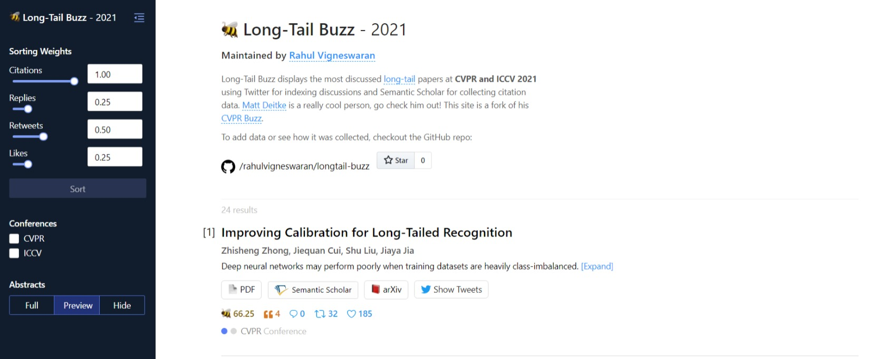

<h1 align="center">
  🐝 Long-Tail Buzz 🍯
</h1>
<h3 align="center"><em>Explore Trending Long-Tail Papers at CVPR and ICCV 2021</em></h3>

  
  
  

 

## 🍴 Acknowledgement
This repo is a fork of [CVPR Buzz](https://mattdeitke.com/cvpr-buzz/).

## 📊 Dataset

The scraping code is in `tasks.py`. Data is cached on the website, which makes it extremely fast to use with GraphQL and allows for fewer dependencies to be relied on.

#### 👁️ CVPR/ICCV Accepted Papers

- The accepted papers and their abstracts are extracted from [CVPR](https://openaccess.thecvf.com/CVPR2021?day=all) and [ICCV](https://openaccess.thecvf.com/ICCV2021?day=all).
- The papers are then filtered based on whether the following tags are available in the title: `"long-tail",
            "long-tailed",
            "long tail",
            "longtail",
            "longtailed",
            "long tailed"`.

#### 📖 Citation Data

Citation data comes from [Semantic Scholar](https://semanticscholar.org). There is no easy way to go from the paper title to Semantic Scholar's paper ID (i.e., it's not possible from the API). So we just search for it with Selenium and apply a few checks to see if it's the same paper.

This may take an hour or so to get through all the papers. There are also occasional hit limits where you may have to pick up from a point. Thus, one may need to monitor the window that opens. (It's possible to automate this by checking for the existence of certain elements on the screen, though I haven't been bothered enough by it to implement this.)

With the paper ID, we can then use [Semantic Scholar's API](https://api.semanticscholar.org/) to easily fetch the number of citations for the paper.

#### 🐦 Twitter

To fetch the engagement for each paper on Twitter, [Twint](https://github.com/twintproject/twint) is used. Currently there are 2 queries for each paper:

1. **Paper title.** Searches for the title of the paper in quotes (e.g., ["VirTex: Learning Visual Representations From Textual Annotations"](https://twitter.com/search?q=%22VirTex%3A%20Learning%20Visual%20Representations%20From%20Textual%20Annotations%22&src=typed_query&f=live)). Paper titles are unique enough that I've found it extraordinarily rare for there to be a tweet with the title of a paper, and it not actually being about the paper. For papers where the title is a common phrase, I have attempted to remove its results.
2. **ArXiv URL.** Search for where the arXiv URL has been shared in quotes (e.g., ["arxiv.org/abs/2006.06666"](https://twitter.com/search?q=arxiv.org%2Fabs%2F2006.06666&src=typed_query&f=live)).

Each unique tweet is only counted once.

One can now also add tweets manually (keep reading), which aren't caught in the above criteria.

#### 📱 Read on Mobile
arXiv Vanity renders academic papers from arXiv as responsive web pages so you don’t have to squint at a PDF. "📱 arXiv Vanity" button has been added right next to the arXiv button. Go check the [💅 arXiv Vanity](http://www.arxiv-vanity.com/) project and support them if you can.

## 👊 Adding Data

_Please open a PR to add new data!_

#### 🐤 Tweets

If you want to index Tweets, open a PR and add them to [manual-data.json](https://github.com/mattdeitke/cvpr-buzz/blob/main/manual-data.json). All that is needed is the account username and the `tweetId`.

For instance, if `https://twitter.com/quocleix/status/1349443438698143744` is the Tweet, one would format it as `["quocleix", "1349443438698143744"]`. The paper IDs (a.k.a. the keys) can be found in `paper-data`.

#### 🏙 Citation Data

Citation data comes from Semantic Scholar. If your paper is on Semantic Scholar, but it is not showing up on the site, please edit the `s2id` field in `paper-data/{paperId}.json`. The `s2id` is found at the tail end of the Semantic Scholar URL.

For instance, if the Semantic Scholar URL is `https://www.semanticscholar.org/paper/Meta-Pseudo-Labels-Pham-Xie/43497fe8aa7c730e075b08facc2aa560a6d4dd85`, the `s2id` would be `43497fe8aa7c730e075b08facc2aa560a6d4dd85`.

## 📄 License

MIT License.
